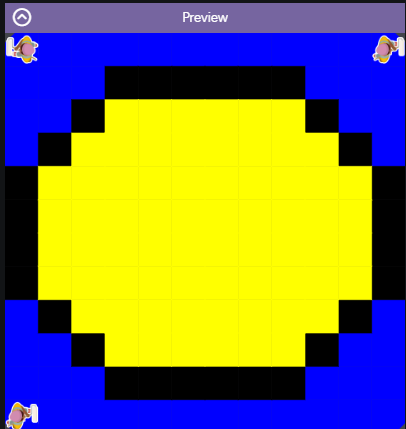

# Asphalt-art-project
Asphalt art project 1.15 CSA code.org

## Output:

## Reflection

1. Describe your project.

   - My project uses subclasses of the painter to create a tennis ball with a blue backround.

2. What are two things about your project that you are proud of?

   - I am proud of completing the project and making the tennis ball circular

3. Describe something you would improve or do differently if you had an opportunity to change something about your project.

   - Write your response here...
if i were to improve i would want to make the tennis ball more detailed and have more subclasses.